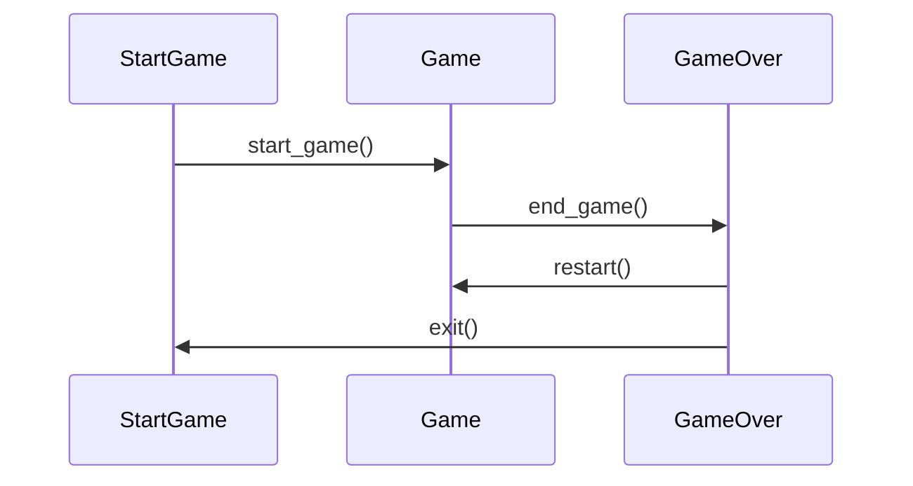

# Arkkitehtuurikuvaus
## Rakenne

## Käyttöliittymä

Käyttöliittymä sisältää kolme erillistä näkymää:

* Pelin aloitus
* Pelikenttä
* Pelin lopetus

Toiminnallisista kokonaisuuksista vastaa luokka Game. Luokka tarjoaa käyttäliittymän toiminnoille metodeja. Näitä ovat esimerkiksi:

* start_game()
* playing()
* game_running()
* exit_level()
