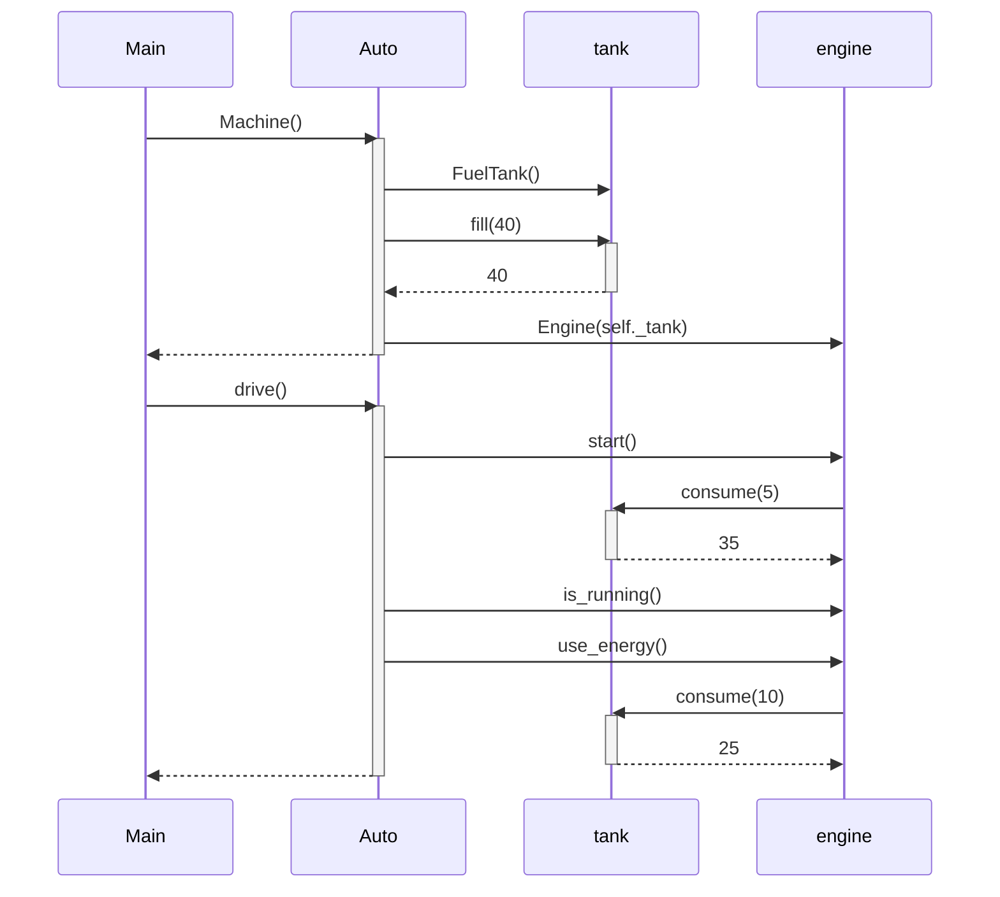

```mermaid

  sequenceDiagram
  participant Main
  participant Auto
  participant tank
  participant engine
  
  Main->>Auto:  Machine()
  activate Auto
  Auto->>tank: FuelTank()
  Auto->>tank: fill(40)
  activate tank
  tank-->>Auto: 40
  deactivate tank
  Auto->>engine: Engine(self._tank)
  Auto-->>Main:  
  deactivate Auto
  
  Main->>Auto: drive()
  activate Auto
  Auto->>engine: start()
  engine->>tank: consume(5)
  activate tank
  tank-->>engine: 35
  deactivate tank
  Auto->>engine: is_running()
  Auto->>engine: use_energy()
  engine->>tank: consume(10)
  activate tank
  tank-->>engine: 25
  deactivate tank
  Auto-->>Main:  
  deactivate Auto
  
```
